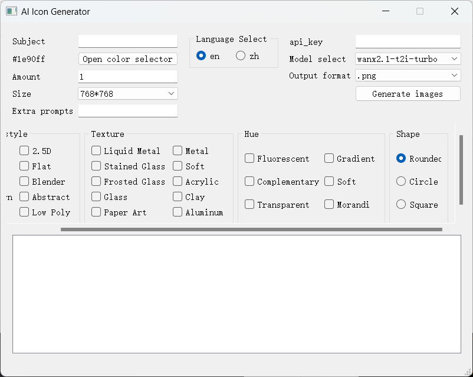
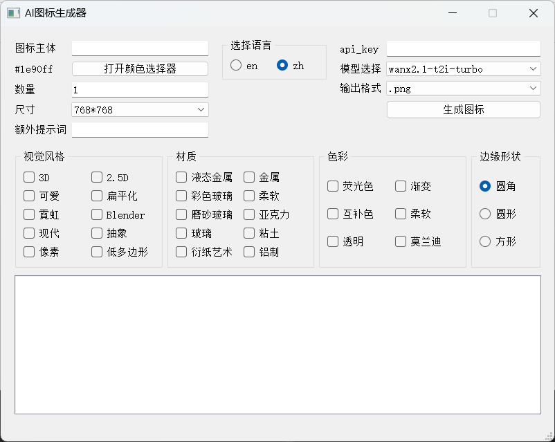

# AI Icon Generator based on PyQt

It's an AI icon generator which uses api keys from aliyun.
You can use the newest text-to-image models by using this program easily
without typing in most of common prompts.
The api keys can be gotten from
[Aliyun Bailian](https://bailian.console.aliyun.com/?tab=model#/api-key)

## How to compile the project?

Personally, I use nuitka to package the project.

Install nuitka first(If you do not have).

**Please do not install it to the virtual environment!**

~~~shell
pip install nuitka
~~~

Then run this command in your shell

~~~shell
nuitka --windows-console-mode=disable --standalone --enable-plugin=pyqt5 --remove-output --follow-imports  --output-dir=build/ --include-data-files=./zh_CN.qm=./zh_CN.qm .\main.py
~~~

**Done!**

# Image Preview
English

Chinese

## Outer links
[Github](https://github.com/HongyiHuang398/QtIconGen_tongyi)