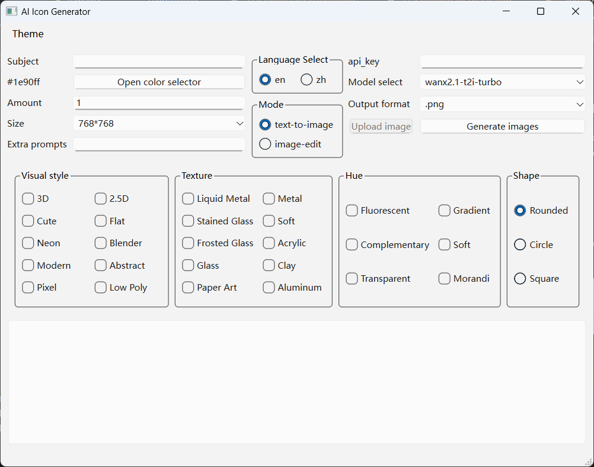
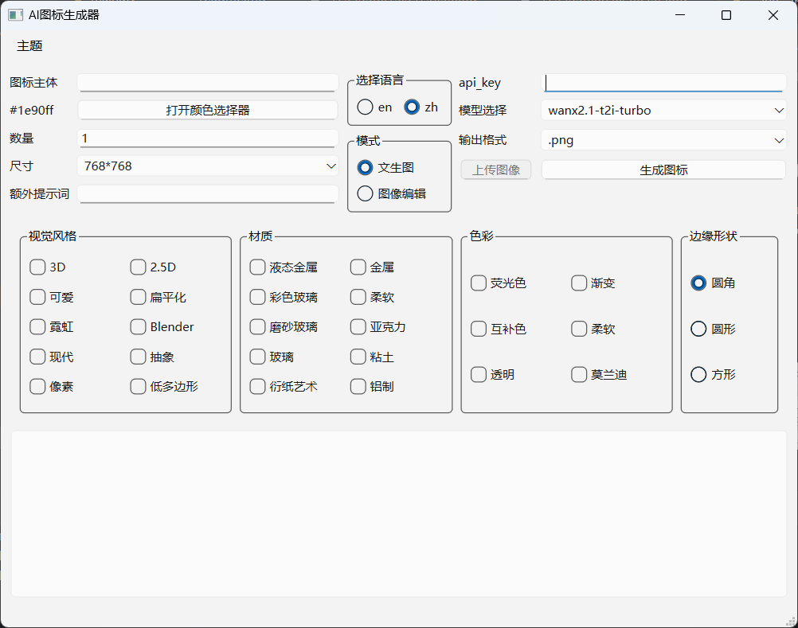

# AI Icon Generator based on PyQt

It's an AI icon generator which uses api keys from aliyun based on Qt(Pyside6) and the SDK from Aliyun.
You can use the newest text-to-image models by using this program easily
without typing in most of common prompts.
The api keys can be gotten from
[Aliyun Bailian](https://bailian.console.aliyun.com/?tab=model#/api-key)

## How to compile the project?

Install python modules first

~~~shell
pip install -r requirements.txt
~~~

Personally, I use nuitka to package the project.

Run this command in your shell.
(Windows, macOS, Linux are all tested and work well)

~~~shell
nuitka --lto=yes --windows-console-mode=disable --enable-plugin=pyside6 --remove-output --follow-imports --output-dir=build/ --include-data-dir=resources=resources --assume-yes-for-downloads --mode=app ./main.py
~~~

**Done!**

# Image Preview (Version 1.0)
English

Chinese

# Image Preview (Old Version)
English

Chinese

## Outer links
[Github](https://github.com/HongyiHuang398/QtIconGen_tongyi)